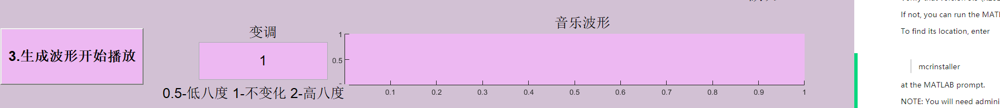

# README.md

## 目录

*   [CH](#ch)

    *   [功能介绍  ](#功能介绍--)

        *   [1.自动分析音频  ](#1自动分析音频--)

        *   [2.创作音乐](#2创作音乐)

    *   [使用方法  ](#使用方法--)

        *   [1.自动分析音频  ](#1自动分析音频---1)

            *   [1）添加音频  ](#1添加音频--)

            *   [2）播放音频  ](#2播放音频--)

            *   [3）开始采样  ](#3开始采样--)

        *   [2.创作音乐](#2创作音乐-1)

            *   [1）添加音乐表格](#1添加音乐表格)

            *   [2）输入参数生成作品](#2输入参数生成作品)

            *   [3）生成波形开始播放](#3生成波形开始播放)

*   [ENG  ](#eng--)

    *   [1.Prerequisites for Deployment   ](#1prerequisites-for-deployment---)

    *   [2.Files to Deploy and Package  ](#2files-to-deploy-and-package--)

    *   [3.Definitions  ](#3definitions--)

# CH

《最伟大的作品生成器》 .exe &#x20;

Author：TX-Leo

Data:2022.07.20

***

## 功能介绍 &#x20;

### 1.自动分析音频 &#x20;

自动分析一段音频的音调和节拍，以及音频所包含的谐波分量，以及播放音频 &#x20;

### 2.创作音乐

根据一个音乐的简谱生成音乐，并调整高八度或者低八度播放 &#x20;

***

## 使用方法 &#x20;

### 1.自动分析音频 &#x20;

#### 1）添加音频 &#x20;

添加音频的例子： &#x20;

`input_example/fmt.wav`&#x20;

&#x20;

#### 2）播放音频 &#x20;

#### 3）开始采样 &#x20;

等待一会后：

***

### 2.创作音乐

#### 1）添加音乐表格

添加音乐表格的例子：

`input_example/ music_table_of_the_greatest_work.xlsx`

格式说明：

第一列对应为是低音（1）还是中音（2）还是高音（3）还是pause（0）

第二列对应为音调

第三列对应为音长

如下图：

#### 2）输入参数生成作品

图中所示为默认参数

等一会再开始下一步

#### 3）生成波形开始播放

这里可以选择变调播放

***

# ENG &#x20;

## 1.Prerequisites for Deployment  &#x20;

Verify that version 9.9 (R2020b) of the MATLAB Runtime is installed.    &#x20;

If not, you can run the MATLAB Runtime installer. &#x20;

To find its location, enter &#x20;

> mcrinstaller &#x20;

at the MATLAB prompt. &#x20;

NOTE: You will need administrator rights to run the MATLAB Runtime installer.  &#x20;

Alternatively, download and install the Windows version of the MATLAB Runtime for R2020b  &#x20;

from the following link on the MathWorks website: &#x20;

[https://www.mathworks.com/products/compiler/mcr/index.html](https://www.mathworks.com/products/compiler/mcr/index.html "https://www.mathworks.com/products/compiler/mcr/index.html") &#x20;

For more information about the MATLAB Runtime and the MATLAB Runtime installer, see  &#x20;

"Distribute Applications" in the MATLAB Compiler documentation   &#x20;

in the MathWorks Documentation Center. &#x20;

## 2.Files to Deploy and Package &#x20;

Files to Package for Standalone  &#x20;

\-music\_12\_export.exe &#x20;

\-MCRInstaller.exe  &#x20;

Note: if end users are unable to download the MATLAB Runtime using the &#x20;

instructions in the previous section, include it when building your  &#x20;

component by clicking the "Runtime included in package" link in the &#x20;

Deployment Tool. &#x20;

\-This readme file  &#x20;

## 3.Definitions &#x20;

For information on deployment terminology, go to &#x20;

[https://www.mathworks.com/help](https://www.mathworks.com/help "https://www.mathworks.com/help") and select MATLAB Compiler > &#x20;

Getting Started > About Application Deployment > &#x20;

Deployment Product Terms in the MathWorks Documentation &#x20;

Center.
